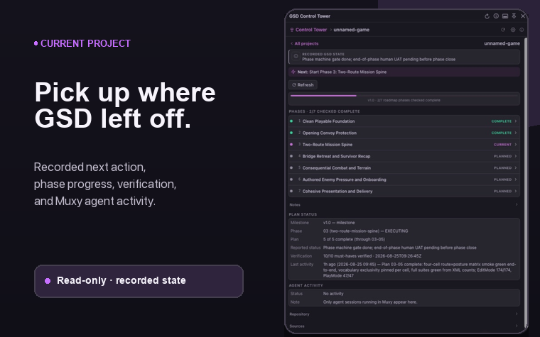

# GSD Control Tower for Muxy

GSD Control Tower is a read-only Muxy panel for projects that use [GSD](https://github.com/open-gsd/gsd-core). It reads the active worktree's `.planning/` files and puts the recorded next action, roadmap progress, phase details, and Muxy agent activity in one place.

Open the panel with **⌘⇧G** or run **Control Tower: Toggle Panel** from Muxy's command palette.



## Pick up the current project

The panel opens on the Muxy project you are already in. From there you can:

- See the next action GSD has recorded for the current phase
- Check roadmap progress and expand a phase to see the artifacts that exist
- Review the current milestone, phase, plan, verification result, and last activity
- See whether a Muxy agent is working, idle, or waiting for you
- Inspect the branch, recent commit, changed-file count, and planning sources

Control Tower does not interpret free-form status text as proof that work is done or blocked. Completion comes from roadmap checkboxes and counts; failed verification comes from a verification artifact; agent state comes from Muxy.

Phase labels follow the same rule: **Current** comes from `STATE.md`, **Complete** from the roadmap checklist, **Paused** from a handoff marker, and **Verification failed** from a typed verification result. A roadmap-only phase is **Planned**; a phase directory with artifacts that `STATE.md` does not select is explicitly **Not current**.

### Inspect phase evidence

Expand any phase to see the workflow artifacts Control Tower found, the plan count, and the recorded verification result. Stage chips reflect files in `.planning/`; they do not infer completion from free-form status text.


## Check every project

Choose **All projects** to see one alphabetical list of GSD workstreams across the projects in Muxy. Search by project, worktree, branch, phase, recorded status, verification result, next action, or agent, and open any row for its project details.

Control Tower does not rank projects or manufacture an attention state. Muxy agent activity, GSD verification, reported status, next action, and parser errors remain separate recorded fields.

## Install

### From the Muxy marketplace

Open Muxy → **Extensions** → **Marketplace**, find **GSD Control Tower**, and choose **Install**.

### From source

```sh
git clone https://github.com/gabeosx/muxy-gsd-control-tower.git
cd muxy-gsd-control-tower
npm ci
npm run build
```

In Muxy, open **Extensions**, choose **Load Unpacked**, and select this repository's `dist/` directory. Rebuild and reload the extension after source changes.

## Requirements

- Muxy on macOS. Version `0.1.0` was tested with **Muxy 1.5.0 (945)**.
- A GSD project with `.planning/STATE.md`. The parser supports `gsd_state_version: 1.0` plus the classic and milestone-era planning layouts covered by the test suite.
- Agent activity requires the agent session to be running inside Muxy.

## Preferences and refresh

Use the gear button in the panel to:

- Choose whether the panel opens on the current project or All projects
- Set cross-project refresh to Manual, 1, 5, 15, or 30 minutes
- Include non-GSD projects or hide individual projects

Planning files for the current project refresh when Muxy reports a relevant file change. Agent activity updates from Muxy events. Use the refresh button whenever you want to reread every project immediately.

## Access and privacy

Control Tower reads project and worktree inventory, GSD planning files, Git status, and Muxy agent state. It stores only preferences and bounded diagnostics in Muxy's extension storage.

The extension does not run commands, edit project files, switch projects or worktrees, read terminal output, send notifications, or make network requests.

Diagnostics may contain relative planning paths and error messages. They do not contain planning-file bodies, terminal output, transcripts, or credentials.

## Current limitations

- GSD planning data comes from each project's active worktree. Other worktrees still show their Muxy agent and Git context.
- Agent sessions running outside Muxy do not appear.
- Remote workspaces are not supported in `0.1.0`.

## Troubleshooting

| What you see | What to do |
| --- | --- |
| Planning data unavailable | Open Diagnostics from the info button. The recent issues list names the file or permission that failed. |
| No agent activity | Confirm that the agent session is running inside Muxy. |
| A project is missing | Check Included projects and the non-GSD setting in Preferences, then refresh. |

## Uninstall

Disable or uninstall GSD Control Tower from Muxy's Extensions screen. The extension never changes project files or Git state, so there is no project-side cleanup.

## Development

Node 20 or newer is required.

```sh
npm ci
npm test
npm run build
npm run validate
```

`npm run build` creates the marketplace package in `dist/`. `npm run validate` checks the manifest, listing assets, permissions, source graph, secret safety, and reproducible build output.

Release history and the marketplace handoff process are documented in [CHANGELOG.md](CHANGELOG.md) and [RELEASING.md](RELEASING.md).
