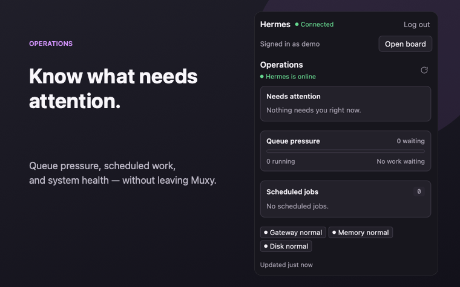
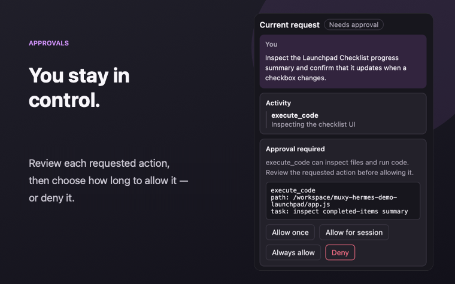
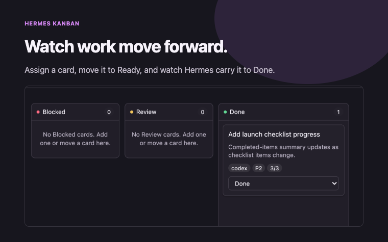

# Hermes Agent for Muxy

[Hermes Agent](https://github.com/NousResearch/hermes-agent) is an open-source AI agent that you run yourself. This extension connects Muxy to the Hermes Dashboard you already have. It does not install Hermes, host it, or change its configuration.

With it, you can check on Hermes at a glance, start and guide agent work, respond to approvals, and manage Kanban boards without leaving Muxy.



## Agent runs and approvals

Open the Hermes panel to start a request and follow the response and tool activity as they happen. When Hermes asks for approval, the request stays on screen until you decide.

- Choose **Allow once**, **Allow for session**, **Always allow**, or **Deny**
- Send more guidance while Hermes is working, or stop the run
- If the live connection drops while the panel is open, the extension reconnects automatically



## Kanban boards

Run **Hermes: Open Project Board** to open one of the boards available in your Hermes Dashboard. Hermes stores these cards and dispatches their work; they are not a second view of requests from the Agent panel.

- Add a card with instructions and assign it to the Hermes profile that should handle it
- Move an assigned card to Ready; Hermes starts a worker, links its run to the card, and moves the card to Running
- Keep the board open to watch the card move to Review, Blocked, or Done as the work progresses
- Move cards yourself when needed; Muxy asks for confirmation before moving one to Blocked or Done

The board refreshes automatically, and you can still refresh it by hand. Closing the board does not stop Kanban work in Hermes; when you reopen it, you will see the latest state. Requests started in the Agent panel stay separate and are not turned into cards.



## What you need

- Muxy
- A Hermes Dashboard that is already running and reachable from your Mac
- At least one password login provider enabled in Hermes

Version `0.1.0` was tested with **Muxy 1.5.0 (945)** and **Hermes 0.20.2**. Other versions may work, but have not been tested yet. If a Dashboard response is not compatible, you will see an error instead of a broken or misleading view.

## Install and connect

1. Install **Hermes Agent** from the Muxy marketplace.
2. Make sure your Hermes Dashboard is running.
3. In Muxy, run **Hermes: Toggle Agent Panel**.
4. Enter the same Dashboard address you use in a browser, select your password provider, and sign in.
5. To use a project board, run **Hermes: Open Project Board**.

If you previously loaded a development build of this extension, remove it before installing `hermes-agent`. The marketplace build uses separate storage, so you will need to sign in once more.

## Compatibility

| Where Hermes is running | How to connect |
|-------------------------|----------------|
| On your Mac | Use the loopback address shown by Hermes, such as `http://127.0.0.1:8642` |
| In Docker on your Mac | Publish the Dashboard port to `127.0.0.1` and use that address |
| On another machine through SSH | Set up a local `ssh -L` forward, then connect to its `127.0.0.1` address |
| At a private HTTPS address | Use its HTTPS address from a trusted network, VPN, or secure access layer you control |
| Inside a Muxy SSH workspace | Not supported in version `0.1.0`; follow [the open issue](./OPEN_ISSUES.md) for progress |

The extension does not need to know whether Hermes is native, in Docker, or behind an SSH forward. It only needs a Dashboard address that is reachable from Muxy.

## Current limitations

- Password login only; OAuth and OIDC are not supported yet
- One Hermes Dashboard connection at a time
- The Agent panel must stay open for live responses, approvals, guidance, and stop controls; it does not keep a background connection
- Kanban workers run in Hermes independently, so closing the Muxy board does not stop them
- The extension does not translate Muxy workspace paths into Hermes filesystem paths
- Muxy SSH workspaces are not supported in version `0.1.0`

## Security

Do not put your Hermes Dashboard directly on the public internet just because it has a password. Keep it on loopback, a trusted local network, a VPN, or a secure access layer you control. This follows [Hermes's own Dashboard guidance](https://github.com/NousResearch/hermes-agent/blob/main/website/docs/user-guide/features/web-dashboard.md).

The extension never approves an agent action for you. Approval requests stay visible until you choose what to do.

Your password is used only to sign in and is then cleared; it is never saved. Live connections use short-lived, one-use WebSocket tickets that are not saved either. The saved session contains only the Hermes cookies needed to sign you back in.

## Permissions

| Permission | What it is used for |
|------------|---------------------|
| Command execution | Uses `/usr/bin/curl` to talk to the Hermes Dashboard. Request bodies and cookies are passed through stdin, not exposed in command arguments. |
| Panel control | Opens and updates the Hermes side panel. |
| Tab control | Opens the Hermes project board. |
| Isolated storage | Saves the Dashboard address, login provider, selected board, and Hermes session cookies for this extension only. |

The extension cannot read or write your workspace files. It does not request Docker, SSH, background-process, or telemetry access.

## Privacy

No analytics or telemetry is collected. The extension stores only the Dashboard address, selected login provider, selected board, and the Hermes session cookies needed to restore your sign-in.

Prompts and controls you submit are sent directly to the Hermes Dashboard you configured. The extension does not send them anywhere else.

## Troubleshooting

| What you see | What to do |
|--------------|------------|
| Invalid password | Check your username, selected provider, and password, then try again. |
| OAuth/OIDC not supported | This Hermes installation has no password provider. Use Hermes directly for now. |
| Sign-in expired | Sign in again. The extension removes the expired session. |
| Permission denied | Review Muxy's permission prompt and retry if you intended to allow the action. |
| Muxy SSH workspace unsupported | Open a local Muxy workspace and use your own `ssh -L` forward or a private HTTPS Dashboard address. |
| Agent connection offline | Keep the panel open. The extension will reconnect with a new one-use ticket. |
| Incompatible response | Confirm that Hermes is healthy and check its version. |
| Some operations are unavailable | That feature or plugin may not be installed in Hermes. Agent and board features can still work independently. |

## Uninstalling

Disable or uninstall the extension from Muxy. This removes the Muxy integration and its access to saved extension data. It does not stop Hermes, delete Hermes data, or change your Hermes installation.

## Development

Node 20 or newer is required.

```sh
npm ci
npm test
npm run build
npm run validate
npm run qualify
```

`npm run build` creates the marketplace package in `dist/`. `npm run validate` checks the package, permissions, assets, secret safety, and reproducible build output. `npm run qualify` tests the supported connection methods in a disposable lab.

`npm run qualify:native` exists only to reproduce the known Muxy SSH-workspace problem. It is not part of the normal release check.

For version history and the draft-only marketplace handoff, see [CHANGELOG.md](CHANGELOG.md) and [RELEASING.md](RELEASING.md).
