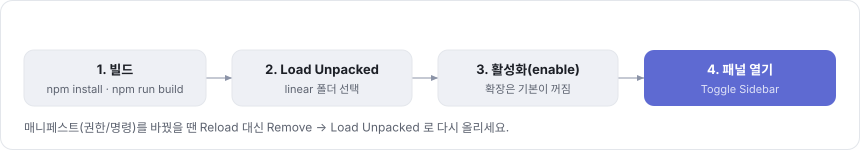
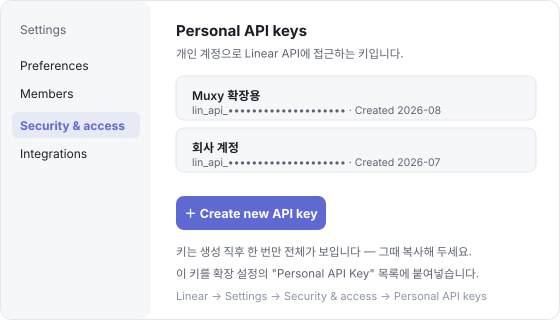
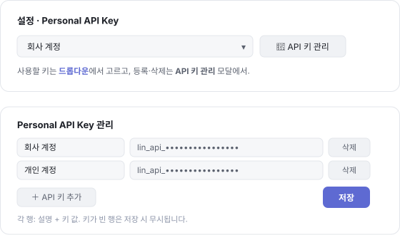

# Linear for Muxy — 초기 세팅 가이드

Muxy 안에서 Linear 이슈를 보고, 클릭 한 번으로 브랜치·worktree를 만들고 Claude Code에게 작업을 넘기는 확장의 **처음 한 번** 설정 방법입니다.

> 📄 기능 개요는 [README](../README.md) 를 보세요.

---

## 1️⃣ 빌드 & 로드

```bash
cd extensions/linear
npm install
npm run build     # dist/ 생성 (package.json 자동 복사)
```

그다음 Muxy에서 아래 순서로 진행합니다.



1. **Extensions** 모달 → **Load Unpacked** → 빌드된 **`extensions/linear/dist`** 폴더 선택 (Muxy가 로드하는 자립형 출력물)
2. 목록의 `linear`를 **활성화(enable)** — 확장은 기본이 꺼짐 상태입니다
3. 패널 열기: topbar의 Linear 아이콘 또는 팔레트(`⌘⇧P`)에서 `Linear: Toggle Sidebar`

> ⚠️ **매니페스트(권한/명령)를 바꾼 경우**엔 단순 Reload로 반영되지 않습니다. **Remove from Muxy → Load Unpacked** 로 다시 올리거나 Muxy를 재시작하세요. 코드/화면만 바꿨을 땐 `npm run build` 후 **Reload** 로 충분합니다.

---

## 2️⃣ Linear Personal API Key 발급

확장이 Linear 데이터를 읽으려면 개인 API 키가 필요합니다. Linear 웹에서 발급받습니다.



- 경로: **Linear → Settings → Security & access → Personal API keys**
- **＋ Create new API key** 를 눌러 새 키를 만듭니다.
- 🔑 키 전체 값은 **생성 직후 한 번만** 보입니다 — 그때 바로 복사해 두세요.

---

## 3️⃣ 확장 설정에 API 키 등록 & 선택

패널 상단의 **⚙ 설정**을 엽니다. 키 등록·삭제는 **별도 관리 모달**에서 하고, 실제로 쓸 키는 설정 화면의 **드롭다운**에서 고릅니다.



1. 설정의 **Personal API Key** 옆 **🔑 API 키 관리** 버튼을 누릅니다.
2. 관리 모달에서 **＋ API 키 추가**로 행을 늘리고, 키마다 **설명**(예: `회사 계정`, `개인 계정`)과 **키 값**을 넣은 뒤 **저장**합니다. (설명·키가 모두 빈 행은 무시됩니다.)
3. 다시 설정 화면의 **드롭다운**에서 사용할 키를 고릅니다. 키를 바꾸면 **기본 팀 키** 목록이 그 키 기준으로 다시 로드됩니다.

이어서 같은 설정 화면에서 아래 값도 지정합니다.

| 항목 | 설명 |
| --- | --- |
| **기본 팀 키** | 필터·이슈 생성에 쓰는 팀(예: `KYL`). 비우면 모든 팀. |
| **기본 베이스 브랜치** | 브랜치를 분기할 기준(예: `develop`). |
| **worktree 생성 위치** | 비우면 저장소 형제 위치에 생성. |
| **사용할 에이전트** | 이슈를 넘길 CLI(예: `claude`). 목록에서 고르거나 직접 입력. |

마지막에 **저장**을 누르면 완료입니다.

> 🌐📁 **글로벌 / 이 프로젝트 토글**: 설정 화면 위쪽 세그먼트로 스코프를 전환합니다. **글로벌 기본**은 모든 프로젝트 공통값이고, **이 프로젝트**는 팀/프로젝트 연결과 함께 **API 키·베이스 브랜치·worktree 위치·에이전트**를 이 저장소용으로 덮어씁니다(`.linear.json`에 저장, 비우면 전역 상속).

---

## 4️⃣ 런타임 동의 (최초 1회)

확장이 코드로 미리 허용할 수 없는 동작들은 Muxy 보안 게이트가 **처음 실행할 때 한 번** 팝업으로 묻습니다. "허용"을 누르면 규칙으로 저장되어 이후엔 다시 묻지 않습니다.

- 🖥️ 터미널 자동 명령 실행 (액션 실행 시)
- 🌿 git 브랜치·worktree 생성
- 🌐 `api.linear.app` 접근 (첫 조회 시)

---

## 5️⃣ (선택) 이 저장소를 Linear 프로젝트에 연결

특정 저장소를 특정 Linear 팀/프로젝트에 매핑하려면 **⚙ 설정**에서 위쪽 스코프 토글을 **📁 이 프로젝트**로 바꾼 뒤, 팀·프로젝트를 고르고 **저장**합니다. 연결 정보와 프로젝트 오버라이드는 저장소 루트의 `.linear.json`에 기록됩니다.

- 폴더명과 이름이 같은 Linear 프로젝트가 있으면 자동으로 먼저 골라줍니다.
- 같은 **📁 이 프로젝트** 탭에서 **사용할 API 키·베이스 브랜치·worktree 위치·에이전트**를 이 저장소용으로 덮어쓸 수 있습니다. 각 항목을 비우면 전역 설정을 그대로 상속합니다.

> ⚠️ 프로젝트 오버라이드는 `.linear.json`에 저장됩니다 — 전용 키를 직접 넣는 경우 git에 커밋하지 마세요(`.gitignore` 권장).

---

## ✅ 세팅 끝 — 이제

패널에 **나에게 배정된 이슈**가 상태별로 뜹니다. 이슈를 클릭해 상세를 보고, **상태별 액션 버튼**(예: 🚀 시작 / 🏁 종료)으로 브랜치·worktree를 만들고 에이전트를 실행하세요. 액션 정의는 **⚙ 설정 → 상태별 액션**에서 편집합니다.
