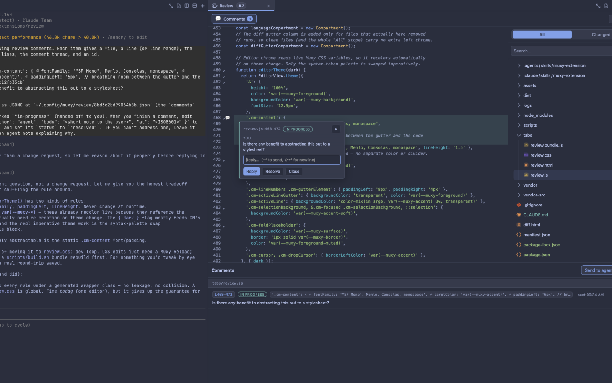

# Review



A full-featured code review tab for [Muxy](https://muxy.app). Browse your
project, read files in an embedded CodeMirror editor with inline `git diff`
highlighting, and leave **per-line comment threads** that you can hand off to a
coding agent (a fresh `claude` terminal, or any running pane in the workspace)
and get replies back — all without leaving the workspace.

## Features

- **File browser + code viewer.** A `[All] / [Changed]` file tree (powered by
  `@pierre/trees`, with git-status badges) on one side; a read-only CodeMirror 6
  viewer with syntax highlighting on the other. Binary files hand off to Muxy's
  native editor.
- **Inline git-diff.** Changed files paint their diff directly in the gutter and
  body: added/modified lines get a green wash, runs of removed lines collapse to
  a ▸ wedge you can expand. Clean files paint nothing.
- **Markdown / HTML preview.** Renderable files get a sticky **Source / Preview**
  toggle. Preview renders inside a fully sandboxed iframe (no scripts), so
  content under review can't reach the host.
- **Per-line comment threads.** Click a line number (or drag the gutter for a
  range) to start a thread — status, replies, resolve/close. Threads persist to
  `~/.config/muxy/review/` (outside any repo, so nothing gets committed) where an
  agent can read and write them. **Send to agent** delivers the open threads as
  markdown to a new or running pane; the agent replies and resolves by editing
  the store file, and the tab reflects it back live.
- **Picks up where you left off.** Scope, open file, scroll position, tree
  expansion, and pane layout are all remembered per project.

## Usage

Open it from the topbar **Review** icon, or run **`Review: Open File Browser`**
from the command palette.

## Permissions

This extension requests only what its features need:

| Permission | Why |
| --- | --- |
| `commands:exec` | Read files, list directories, run `git diff` / `git status`, and read/write the comment store. All shell access goes through **four fixed proxy scripts** with variable input passed via the environment, so Muxy's "Allow & remember" grant is bound to a constant command line — the tab can't run arbitrary shell. The read/diff proxies refuse absolute paths and `..`; the store proxy only touches hex-named JSON under `~/.config/muxy/review/`. |
| `tabs:read` / `tabs:write` | Open the Review tab and spawn a terminal tab for a new agent. |
| `panes:read` / `panes:write` | List the workspace's panes as send targets, and deliver a comment thread into the chosen pane (`panes.send` + an Enter keystroke). Both prompt for runtime consent on first use. |
| `projects:read` | Resolve the active project root to scope the file tree and comment store. |
| `worktrees:read` | Resolve the active worktree when listing changed files. |
| `notifications:write` | Post toasts (e.g. confirming a thread was sent). |

Per-line comments live **outside** any repository
(`~/.config/muxy/review/<sha256(project root)>.json`) so they are never
committed. The store is plain JSONC — an agent can read it, append replies, and
flip a thread's status.

## Building from source

The runtime libraries — CodeMirror 6, `@pierre/trees`, and `marked` — are
ordinary npm `dependencies` (see `package.json`); the source tree itself ships
only readable code (`tabs/review.js` + the thin `lib/` adapter modules), no
minified vendor bundles. The bundle is produced at build time. First install the
dependencies, then build:

```sh
npm install        # install the libraries into node_modules (writes the lockfile)
scripts/build.sh   # bundle tabs/review.js + deps -> tabs/review.bundle.js, refresh dist/
```

Then click **Reload** in Muxy's Extensions settings.

For the **marketplace**, `npm run build` assembles a self-contained `dist/` by
bundling `tabs/review.js` and its dependencies with esbuild (this is exactly
what the store pipeline runs after `npm ci --ignore-scripts`). `dist/` is the
only thing shipped to users — source and dev files stay behind. `npm run
preflight` runs the extension through the real `muxy-app/extensions` tooling
(build → validate → pack) locally before you open a PR.

## License

MIT
